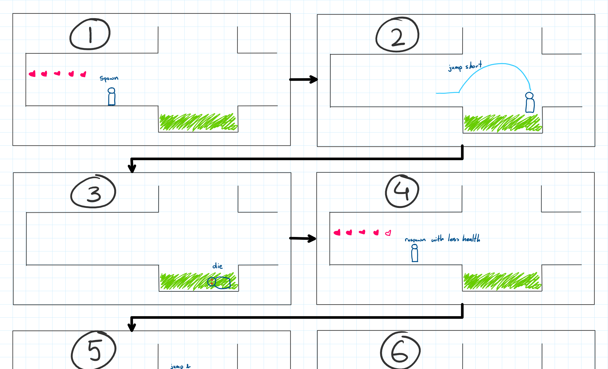

[](https://classroom.github.com/a/YyUO0xtt)
# COMP2150  - Level Design Document
### Name: Mira Huhta
### Student number: 47908602

This document discusses and reflects on the design of your platformer level for the Level Design assessment. It should be 1500 words. Make sure you delete this and all other instructional text throughout the document before checking your word count prior to submission. Hint: You can check word count by copying this text into a Word or Google doc.

Your document must include images. To insert an image into your documentation, place it in the "DocImages" folder in this repo, then place the below text where you want the image to appear:

```

```

Example:


## 1. Player Experience (~700 words)
  
### 1.1. Discovery
    My level design facilitates the player experience goal of discovery through the gradual introduction of core mechanics and areas that are heavily punishing if the player is unable to learn said mechanics. In my first section of the level, basic mechanics of acid, spikes and enemies are introduced in quick succession but in a way that is not too punishing for the player.
    Dying to the acid will only respawn you a few steps away from it, whereas in a later encounter, the acid will set you back extremely far.

    The narrow spike jump is used later in more stressful situations with several enemies and moving platforms to land on, but here the only threat is the spike and even if you are damaged by it, the character's invulnerable state triggers and allows you to simply step over it without taking more damage.
    The enemy is large enough to force players into taking the route above them to avoid it. Circling behind the enemy gives players the gun pickup and introduces them to a very simple enemy interaction. In later encounters, a combination of jumping and shooting and dodging projectiles is required to deal with enemies.
    These simplified encounters of the three main threats present in the level allow players to discover mechanics as they go and the placement of each threat gives players time to learn in relative safety without being too slow or boring.


### 1.2. Drama
    My level design facilitates the player experience goal of drama through the steady increase in difficulty created by combinations of different mechanics. Tension is built throughout the level as the player must combine mechanics they've previously encountered, culminating in a highly stressful area requiring pushing a box off a moving platform, navigating said moving platforms, shooting enemies and avoiding falling in acid.

    This area is preceded by a calmer area of puzzle solving, that introduces moving a box off a moving platform and only contains a few enemies.

    These areas, coupled with places that force the player to renavigate through previously explored areas allow a player to have moments of relief from the otherwise increasingly difficult level.


### 1.3. Challenge
    My level design facilitates the player experience goal of Challenge through an increasingly difficult level design that combines several mechanics into a "final area". This area is located before the third key and is what I would consider to be the main challenge of the game, however, smaller challenges are present before every key that you must collect.
    The first key's challenge is the easiest, requiring the player to navigate from 2 moving platforms with an enemy spitter in the middle.

    This combines what the player previously learns about acid, enemies and moving platforms and is simple and relatively easy for the player to complete. In addition to the key, the player must also trigger a switch to open a door to the next section. The lack of multiple enemies and simple platforming allows players to slowly get in the flow state while being challenging for a beginning area.

    The second key's challenge becomes much more difficult.

    The player is teased with the staff pickup that they can see through a destructible wall (that they cannot break), forcing the player to navigate through branching paths to get to the staff. If they choose to go down branching paths, they will find the key and the switch for the next section blocked behind destructible objects, forcing them to backtrack through difficult platforming (consecutive narrow spike jumps and vertical moving platform jumps) to get the staff first. The path to the staff has a narrow spike jump onto a moving platform, along with a few enemies and vertical moving platform jumps. Getting the key requires the player to break a destructible wall, which if not carefully done will drop players back to the beginning of the first section. The switch path introduces the concept of moving a box to use as a platform to jump higher. The addition of multiple paths and more difficult mechanics allows players to fully utilise their flow state as they proceed from one challenge to the next, as well as being a middle-ground between easy and difficult so the level doesn't feel like it gets too difficult too quickly.

    The final key's challenge is a combination of challenging platforming and puzzle solving, as well as managing enemies and branching paths.

    Firstly, the key is hidden behind a breakable wall, forcing players to explore every branching path. The platforming is incredibly challenging, with moving platforms that are very small, as well as countless enemies. Once the key is obtained the player must still fight through a small area packed with enemies before the level is complete. This combination of puzzle solving, enemy management and challenging platforming is the perfect final challenge that requires players to be precise with their movements and make few mistakes.


### 1.4. Exploration
    My level design facilitates the player experience goals of exploration through the use of branching paths and environment design that alludes to areas beyond line of sight. From the second section onwards, the game requires you to take multiple paths to continue. Some paths that do not directly progress the game reward players with health pickups, again encouraging them to explore. Areas have different plants and details to allow players to recognise and remember places they may need to go.


    The placement of clouds in one area point toward the path that the key is on,


    The stalactites in the background tell players that the area they're in continues upward.


    The flower in acid that is pointing towards the left hints players that the box on the platform should be moved in that direction.


    These are the main examples of the environment alluding to different areas or hinting the player to where things are. The game's requirement of exploring several branching paths along with rewards for non-necessary ones, and the careful placement of decor in the environment all contribute to inviting the player to explore.

## 2. Core Gameplay (~400 words)

### 2.1. Acid
Acid is introduced first to the player as it is used frequently throughout the rest of the level and is in my opinion the easiest mechanic to understand. Additionally, as the acid spawns the player back at the beginning or nearest checkpoint, I wanted it to not be annoying for players to backtrack to the encounter if they fall in.



### 2.2. Spikes
Spikes are introduced second to the player as they are frequently used thorughout the level in increasing difficulty and it is important for player's to understand their mechanics.


### 2.3. Spitters, Passthrough Platforms, Weapon Pickup (Gun)
Spitters, passthrough platforms and the gun are all introduced at the same time. Forcing players to jump through the passthrough platform as they have nowhere else to go due to the spitter blocking their way teaches them how the platforms work as well ass that spitters are enemies that hurt you. I think the gun has to be introduced at the same tinme as an enemy as it teaches players that shooting will kill enemies.


### 2.4. Moving Platforms
Moving platforms are introduced to the player in a low risk environment where dying in the acid below it doesn't send them back too far. Jumping onto a moving platform requires more precise inputs which is why it is introduced after more simple obstacles such as the acid or spikes.


### 2.5. Checkpoints, Health Pickups
Checkpoints and health pickups are introduced at the same time, allowing players to take damage, learn they respawn at the checkpoint and then heal directly afterwards. They are introduced later as they require the player to have progressed enough to have taken damage and to feel as if they are no longer at the spawnpoint.


### 2.6. Keys
Keys are introduced after most obstacles, allowing these obstacles to be used to block the path of the key.


### 2.3. Chompers
The chomper is introduced quite late so as to not overwhelm players with too many enemy types at once and instead allow them to get used to shooting enemies that won't move toward them.


### 2.11. Weapon Pickup (Staff)
The staff is introduced last as its main use as a tool to destroy walls and columns is more complicated and requires players to have a basic knowledge of the other mechanics so that destructible objects can be implemented in interesting ways.


## 3. Spatiotemporal Design
### 3.1. Molecule Diagram

### 3.2. Level Map – Section 1


### 3.3.	Level Map – Section 2


### 3.4.	Level Map – Section 3

## 4. Iterative Design (~400 words)

